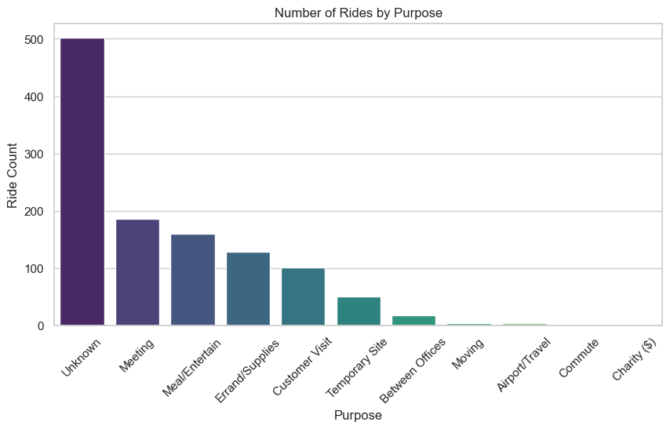
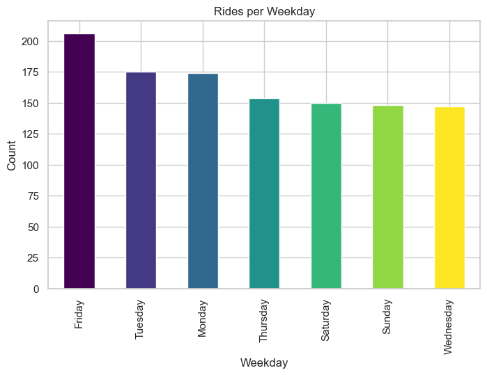
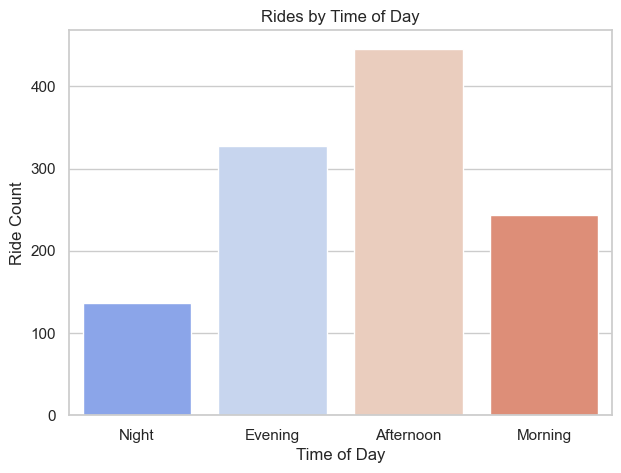
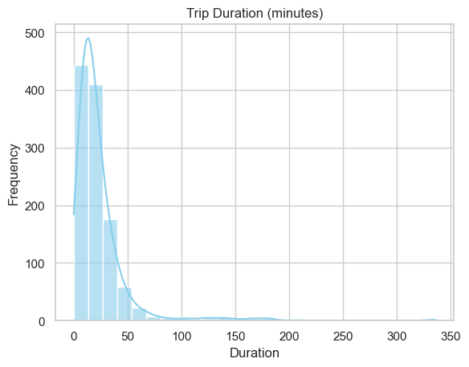
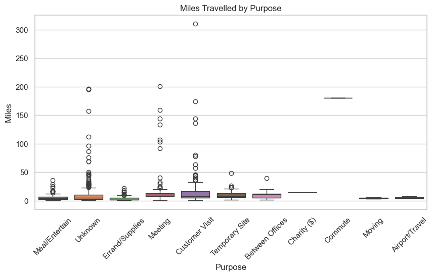

# 🚕 Uber Rides Analysis

This project analyzes Uber ride data to understand how people use cab services in terms of time, distance, and purpose of travel. The goal is to identify demand patterns, busiest days, trip behavior, and provide useful business recommendations.

---

## 📌 Project Overview

In this project, the dataset is cleaned, processed, and analyzed to extract meaningful insights such as:

- When people book Uber the most
- Why rides are taken (purpose of travel)
- Which days and hours are busiest
- How far and how long people usually travel
- Which trip types involve long distances

The project is completely implemented in Python using Jupyter Notebook.

---

## 🗂️ Dataset Description

**Source:** [Uber Dataset](https://www.kaggle.com/datasets/ruchikakumbhar/uber-dataset) (Kaggle)
The dataset contains Uber ride records including:

- Start and end datetime  
- Miles travelled  
- Category and purpose of ride  
- Start and end locations  

Additional engineered fields created:

- Trip duration in minutes  
- Weekday name  
- Month name  
- Hour of day  
- Time of day category (Morning, Afternoon, Evening, Night)  

---

## 🧹 Data Cleaning Performed

- Removed duplicate records  
- Handled missing values  
- Converted date columns into datetime format  
- Removed rows with invalid dates  
- Created new time-based features  

---

## 📊 Visualizations

All generated plots are saved in the `images/` folder automatically.

### 1️⃣ Rides by Purpose

### 2️⃣ Rides by Weekday

### 3️⃣ Rides by Time of Day

### 4️⃣ Trip Duration Distribution

### 5️⃣ Miles by Purpose (Boxplot)

### 6️⃣ Ride Demand Heatmap
.png)

---

## 🧠 Key Insights

- Uber is used mainly for business purposes such as meetings and customer visits  
- Demand is highest during weekdays, especially Friday  
- Afternoon and evening are the busiest ride periods  
- Airport and customer visit trips involve higher distances  
- Most rides are short-duration city trips  
- Night-time ride demand is very low  

---

## 🧭 Business Recommendations

- Increase driver availability during weekday afternoons and evenings  
- Place drivers near corporate hubs and airports  
- Offer discounts on weekends or late nights to balance demand  
- Promote shared rides for long-distance airport trips  
- Improve ETA accuracy during peak hours  

---

## 🛠️ Tech Stack

- Python  
- Pandas  
- NumPy  
- Matplotlib  
- Seaborn  

---

## 📁 Project Files

- `uber_rides.ipynb` – main notebook  
- `Uber.csv` – dataset   
- `images/` – visualizations folder   

---

## 🚀 How to Run This Project

1. Open Jupyter Notebook  
2. Run all cells in `uber_rides.ipynb`  
3. Images will be generated automatically

---

## 🧾 Key Metrics Summary

| Metric | Value |
|--------|-------|
| Total Rides | 1K+ |
| Total Miles Travelled | 20K+ miles |
| Average Trip Distance | ~7–10 miles |
| Average Trip Duration | ~25 minutes |
| Busiest Day | Friday |
| Busiest Time of Day | Afternoon & Evening |
| Most Common Purpose | Business (Meetings & Customer Visits) |
| Longest Trips | Airport & Inter-city travel |

---
## 🔗 Connect With Me

- **LinkedIn:** https://www.linkedin.com/in/akhilesh-yadav88/
- **Portfolio:** https://yaadavakhilesh.github.io/
- **GitHub:** https://github.com/YaadavAkhilesh
- **Email:** yadavakhil766@gmail.com

---

⭐ If you found this project helpful, consider giving it a star!
